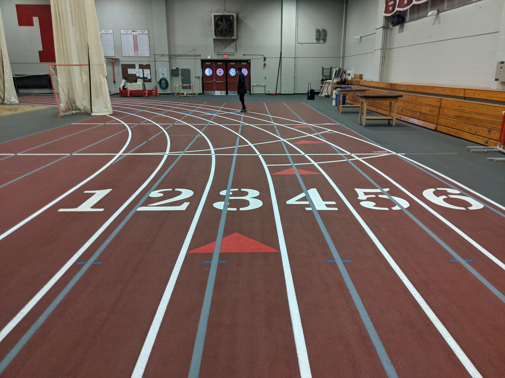

| Deliverable | Due Date              |
|---------------|----------------------------------------------------------------------------|
| Race Day | TBA |
| Code Pushed to Github  | TBA |
| Briefing (15 min presentation + 5 min Q&A) OR Report ([github pages](https://github.mit.edu/rss/website2021)) | TBA |
| [Team Member Assessment](https://forms.gle/5npgrmk8mjdRGGcL7)  | TBA|

# Final Challenge 2022

## Introduction

Congratulations on completing the six labs of RSS! 

This semester, you've learned how to implement real-time robotics software on a widely-used software framework (ROS). You know how to read sensor data (LIDAR, Camera, Odometry) and convert it into a useful representation of the world (homography, localization). You've written algorithms which make plans over the world's state (parking, line following, path planning) and couple with controllers (PD control, pure pursuit) to accomplish tasks. 

Now, your team will synthesize all that you've learned to design a competitive entry for the *2022 RSS Final Challenge*! 

## Introduction
In a world far, far away...

Your beloved racecar that you've spent three months bonding with has been kidnapped by the evil RACECAR Em-tire and transported to a new world! It seems very similar to our own, though there seem to be a couple of differences:
- The cities seem to be built on a smaller scale
- Beyond the city, there are colorful roads
- The only moving agents seem to be autonomous racecars!
You've heard that there's a portal back to Earth at the end of the Rainbow Road outside of the city, but the Em-tire has demanded that your car participate in a race for the entertainment of the populace before it is to be allowed to leave the city gates. Moreover, once your racecar leaves the racetrack arena, it must drive safely through the city to get to the Rainbow Road or else the Em-tire will get angry and keep your car hostage (apparently, they're particular about the stop signs!).

Luckily, you're armed with your knowledge from RSS and a good SSH connection! Let's get your racecar back home to MIT!

## Grading

| Deliverable  Grade | Weighting             |
|---------------|----------------------------------------------------------------------------|
| Part A: Final Race (out of 100)  | 35% |
| Part B: City Driving  | 25% |
| Part C: Rainbow Road [BONUS]  | 10% |
| Briefing OR Report Grade (out of 10) | 40% |

### Part A: Final Race
Part A is worth 35% of your Final Challenge technical grade. Your grade will be calculated based on the time your car takes to drive around the track (`best_race_split`, in seconds) as follows:

  `Part A grade = min(100 + (50 - best_race_split), 110)  - penalties`

Where `penalties` is calculated as follows:

  `penalties = 15 * num_collisions + 5 * num_lane_line_breaches + 5 * num_long_breaches`
  
And `num_lane_line_breaches` is the number of times the car drives outside of either lane line, and `num_long_breaches` is the number of times the car has driven outside of its lane and stayed outside of the lane for greater than 3 seconds.

As you can see from this grading scheme, it is possible to receive bonus points for a very fast and precise solution. The **maximum speed of your car should be capped at 4 m/s**; you should be able to get full points (with bonus!) with a good controller. You should, above all, prioritize avoiding collisions, and if your car leaves its lane, it should quickly recover. More information about race day can be found below in this handout.

### Part B: City Driving

Part B is worth 25% of your Final Challenge technical grade. Your grade will be calculated based on timed completion through the course (`best_city_time`, in seconds) and the number of `penalties` you incur as follows:

`Part B grade = min(100 + staff_multiplier * (30 - best_city_time), 110) - penalties + car_wash`

Where `staff_multiplier` is a calibrating constant based off of the staff solution (TBA), `car_wash` is a possible 5 points if your car drives through the car wash and 0 points otherwise, and `penalties` is calculated as follows:

`penalties = 5 * num_collisions + 10 * traffic_infractions + 10 * manual_assist`

And `num_collisions` is the number of times the car collides with anything in the city (ie. buildings, bricks, road signs), `traffic_infractions` is the number of times the car passes a stop sign without stopping for the correct duration or stops at a non-stop sign, and `manual_assist` is the number of maneuvers (counted individually for turning a corner, stopping at a stop sign, resetting a car, etc.) that required manual teleop intervention.

As with Part A, it is possible to receive bonus points for a fast implementation, yet it is important to prioritize the accuracy of the maneuvers. The **maximum speed of your car should be 1 m/s**. However, operating at maximum speed for your entire run will be very challenging for this task. You should start slow and conduct tests to select an appropriate target speed for your car. To receive full credit over this ~15 meter course, you will need to cover an average of around .5 m/s (but this value will be calibrated by our staff solution completion speed).

### Part C: Rainbow Road [EXTRA CREDIT]

Part C can add an additional 10% to your Final Challenge technical grade! Your grade will be calculated based on the number of `penalties` you incur as follows:

`Part C grade = min(100 + 2 * staff_multiplier * (5 - best_race_split), 110)  - penalties`

Where `staff_multiplier` is a calibrating constant based off of the staff solution (TBA) and `penalties` is calculated as follows:

  `penalties = 5 * num_lane_line_breaches + 5 * num_long_breaches`
  
And `num_lane_line_breaches` is the number of times the car drives outside of the Rainbow Road, and `num_long_breaches` is the number of times the car has driven outside of the road and stayed outside of the lane for greater than 3 seconds.

The **maximum speed of your car should be 1.5 m/s**. 

**Your team will choose between completing a final briefing or report (you do not need to complete both).**

### Briefing Evaluation (see [technical briefing rubric](https://docs.google.com/document/d/1NmqQP7n1omI9bIshF1Y-MP70gfDkgEeoMjpWv8hjfsY/edit?usp=sharing) for grading details)
When grading the Technical approach and Experimental evaluation portions of your briefing, we will be looking specifically for **illustrative videos of your car following the track lane and Rainbow Road as well as executing city driving maneuvers.** Specifically, we would like videos highlighting:
- Visualization of lane / marker tracking and stable drive control within a lane
- Stopping at stop signs and making turns through the course
- Recovery of your car if it is outside of its assigned track lane
- Segmentation using machine learning of the Rainbow Road against Marigold Karpet

### Report Evaluation (see [technical report rubric](https://docs.google.com/document/d/1B6l7vKJFN3CPPcMn8cKKArHUU_Bq_YUZ5KxKoP6qMk0/edit?usp=sharing) for grading details)
When grading the Technical approach and Experimental evaluation portions of your report, we will be looking specifically for the following items:

- **Numerical evidence that your algorithms work in the form of charts/data**
  - Numerical evaluation of the success of your lane tracking + following
    - Make sure to mention your method for finding the lane and tuning the controller to closely track it.
  - Numerical evidence evaluating the success of your city driving algorithm
    - Make sure to mention your method for recognizing stop signs and driving through the buildings as well.
  - Numerical evidence evaluating the success of your Rainbow Road segmentation algorithm
    - Make sure to mention your method for training your model and tuning the controller to closely follow the road.

## Part A: Final Race

### Environment and Task

The Final Race will take place on the entire Johnson track loop. This is a standard-size 200m track. Cars may be assigned to follow any of the track's six lanes and will be informed of their lane assignment the morning of the race. Lanes are numbered from left to right as shown in the image below.

<!--  -->

Your car's task is to complete the 200-meter loop around the track as fast as possible, while staying in your assigned lane. Any kind of collision (with another car or with something in Johnson) will be penalized heavily. You should have some kind of safety controller running on your car, but be careful that this doesn't stop your car if there is another car driving next to it on the track! 

### Race Day
On race day, multiple teams will set up on the track at the same time. A TA will give the start signal, at which point the race begins! You must have a member of your team closely follow your car along the track with the controller ready to take manual control at any moment (yes, a great opportunity to exercise). Your car's split will be recorded at the finish line, and TAs will also be stationed at various points along the track recording lane breaches, if they occur (but hopefully no collisions). Each team will have the opportunity to race **three** times, and we will take the best score.

### Tips

Here are some things you may consider in developing your approach:

- How can you reliably segment the lane lines?
- How can you obtain information about the lane lines in the world frame?
- How can you detect if the car has drifted into a neighboring lane?

Please note that Hough Transforms will very likely be useful; helpful resources are [here](https://towardsdatascience.com/lines-detection-with-hough-transform-84020b3b1549) and here(https://docs.opencv.org/3.4/d9/db0/tutorial_hough_lines.html).

## Part B: City Driving

### Environment and Task

The City Driving challenge will take place in the "MiniCity" course set up in the center of the Johnson track.

The configuration of the final MiniCity is not known until Race Day (the Em-tire is keeping your racecar locked inside the arena until you race!), though you have seen from leaked images that the following elements are present:
- buildings of different sizes
- stop signs
- other road signs
- red bricks
- car wash

Your job, after finishing your race successfully, to drive from the start of the course out of the city and through the Rainbow Road (part C). The roads are conveniently marked with an orange line down the center. However, you have been warned that stop signs must be observed and the car must come to a full stop or else the Em-tire will get angry! Other road signs, however, you may not stop at and will be penalized for doing so. For some reason, there are also a large number of red bricks lying around the city--be careful your car does not recognize these as stop signs; otherwise, you might not get out in time!

<!--  -->

The Em-tire, in their infinite wisdom and with their love of buzz words, has already created a ~ machine learning ~ based stop sign detector for you (located in /city_driving)! It not only tells you if there's a stop sign, but where in your image the stop sign is (nifty!). If you don't use it, the Em-tire will be mad that their hard work went to waste, but you are free to modify the code for the detector and add higher level logic to take advantage of it.

Of course, you are to avoid crashing into buildings as well. Somewhere in the city there is also a car wash; you've heard that going through the car wash might save you some time (and provide a bonus as the Em-tire values cleanliness), though it seems that your car's LIDAR will not work inside...

### Clarifications

- The orange line will never drive you into obstacles.

- The orange line will never split.

- The orange line will not enter the car wash. The car wash entrance and exit will be covered in blue streamers which will look like a wall to your lidar. The car wash will have walls bounding its interior and the orange line will pass by its exit.

- The bricks will not be in the way of the robot. They will just be visual distractors that will make stop sign detection more difficult than simply color segmentation.

### Tips

The City Driving Challenge is meant to be open-ended. You should make use of whatever techniques you believe will best solve the problem.

Here are some things you may consider in developing your approach:

- How do you implement the high-level logic that puts together line-following, stop sign detection, and collision avoidance?
  - Perhaps a state machine would be helpful--how would you connect the different tasks?
- How should the speed of your car be adjusted as you detect a stop sign, decide it is close enough, and turn corners?
- The stop sign detector is good, but not perfect. How might you account for this for robust city navigation?

As always, your safety controller should be turned on for this portion of the Final Challenge as well, although the city will not damage the car should you collide with anything.

## Part C: Rainbow Road [EXTRA CREDIT]
** currently a work-in-progress; updates will be made to these instructions**

### Environment and Task

You've almost made it back home! The last thing to do is to drive through the outskirts of the city back to the portal that leads to MIT along the Rainbow Road. More hacked images have been leaked... but why is the road so colorful?! You can definitely tell where the road is, but your car will get confused if you stick to color segmentation for sure. Legend has it that the surrounding flower field (the infamous Marigold Karpet) is poisonous to racecars, and there are no invincibility stars to be found!

Lucky for you, your car has been in this treacherous flower field before, and, in fact, has unobstructed access to it before race day! Not only that, your car also has some Expert Road Recognizers (your team) to help learn what is safe road to drive on and what is horrible, allergy-causing plant-life!

For this task, you will design and train your very own simple neural network to help identify the road. To do this, you will do the following high-level steps:

- Drive around the Marigold Karpet track, recording your car's camera feed in a rosbag.
- Extract a bunch of individual images from the rosbag.
- Annotate each of the images, clicking a polygonal bounding box to segment out the road.
  - This breaks up the image into patches or gridcells of a specified size. Any patch within the polygon you specify will be considered "road," all others are not.
  - The annotations are saved as numpy arrays of size `[height of image // height of patch, width of image // width of patch]`, representing binary masks where `1`s denote road.
- Upload your images and corresponding annotations to Google Drive
- Fill in a neural network architecture in a given Colab notebook
  - The neural network breaks the image into patches (as the annotation code does) and, for each patch, predicts whether it is road or not. This gives a low-resolution road
  segmentation that can be used for path following.
- Tune the hyperparameters of the neural network
- Train and re-tune as needed
- Download the saved weights of the neural network onto your car
- Run the inference-time code to load up the weights, subscribe to your camera, and output a binary mask of where the road is.
- Use this for line-following.

### Specific Task Instructions
Assuming you are in the `road_detector` directory:

* Drive the car with `zed` and `teleop` with `rosbag record -O [bag file path] /zed/zed_node/rgb/image_rect_color` to record images of the track.
    * If you have a Velodyne car, you may have already created a node that flips the image for you. Subscribe to that node instead.
* Modify the image extraction code in the following ways:
    * Check how many images are in the rosbag by running `rosbag info [bag file path]`.
    * Modify `cb()` in `img_saver.py` to have the variable `total_images` equal to the number of images in the rosbag.
    * Modify the same function to have `flip` set to `True` if camera is mounted upside down. Of course, do not do this if you subscribed to a node that does that for you in the first step. If you did subscribe to a different topic, change the topic in the subscriber initialization at the bottom.
    * Also modify the path to the folder where extracted images are saved in `process_imgs()` (e.g. `./saved_images`).
* Run `roscore`, `python3 img_saver.py`, and `rosbag play [bag file path]` in that order. This populates the saved images folder with images from the camera.
* Move some of the images from that folder into `images`. These will be the images trained/validated on and that require annotation. Move some others to `testimages`. These are the images the neural net will be tested on.

You've now extracted the images. On to annotations:

* Modify `__utils__.py` to have the desired patch size (`H`, `W`).
* Run `python3 annotate_imgs.py --path [path to images to annotate = ./images] --results [path to folder where annotations are saved = ./results]`
    * Click on `n = 10` points bounding the road to create a polygon around it, thus marking all patches in those as ones on the road. Then, close the window to move on to the next image. You may need to close out a tiny menu window between images too.
    * This can be run in Docker, but requires a bit of setup. First, `sudo apt install python3-pip python3-tk`. Then, `pip3 install matplotlib pillow Shapely`, and any other library that isn't already installed / throws an error.

Now, time to build your neural net and train:

* Upload a copy of `final-challenge-ml-folder` to Google Drive.
* Upload the contents of `images`, `testimages`, `results` to the corresponding Google Drive folders within `final-challenge-ml-folder`.
* Fill out the TODOs in `TrainNotebook.ipynb`
* Run all the cells to train. This saves the checkpoints to `checkpoints` folder in your Drive.

Finally, on to deployment of the neural net: 
* Download whatever weights you saved in `checkpoints` that you would like on the real car.
* Modify `path_to_model_weights` in `__utils__.py` to point to that weights file.
* Copy-paste your model architecture from the Colab notebook into `model.py`.
* Copy the `road_detector` file over to a Razer computer (omitting the rosbag and any training/test data/other images, but including all code and the network weights).
  * You do not need to do this if you have a computer with ROS and Torch installed on it.
* Set up two-way ROS communications between the car and your computer -- see Lab 3 for this (it's the `ROS_MASTER_URI, ROS_IP, /hosts/` thing).
* Run `teleop` and `zed` on the car and `python3 road_detector.py` on the computer.

You now have a node that publishes inferred binary masks of the road to `/road_mask` in the form of `Image` messages, where 1s are road and 0s not. You can now use these for line-following, similar to how you did it for lab 4.

### Race Day

### Tips

Here are some things you may consider in developing your approach:

- This task can be easily parallelized -- data collection can happen at the same time as neural network construction.
- Torch documentation (https://pytorch.org/docs/stable/nn.html) is your friend! Similarly, if confused about Torch syntax, try to look up examples of it online.
- Since there's a lot of code to sift through, we've marked all locations where you need to actually change stuff with `TODO` comments. Please ctrl-F to look for those so you know you aren't missing anything.
  - Naturally, do not hesitate to ask questions on Piazza.
- Remember to use Colab's GPU backend. It speeds up training a LOT. `Runtime > Change Runtime Type > Hardware Accelerator > GPU` on Colab.
- We expect the neural net to be imperfect. It may label some offroad parts as being road. Thus, you may want to use contractions and dilations to get rid of those outliers, like with color segmentation in lab 4. If even that does not get rid of the outliers, then use the largest continuous patch of `1`s in the mask as road (akin to using the largest contour in lab 4).
  - Likewise, you can ignore any patches labelled as road that are too high up in the image (e.g. are background objects or on the ceiling or something).
  - Another way to deal with outliers is to use the softmax function on your neural net's output (so that each patch has a probability of being road). Then, only look at patches with more than some threshold probability (e.g. 80%) of being road, rather than 50% (which is what happens when you use `torch.argmax`).

## General Notes

### Structuring your code

The final challenge is the most open-ended assignment in RSS, and comes with minimal starter code. We suggest referring to previous labs for good practices in structuring your solution:
- Start by defining what nodes you will create, what they will subscribe to, and what they will publish. From this plan, write skeleton files, then split up the work of populating them with working code.
- Make useful launchfiles and set launch-time variables via rosparams. Refer to previous labs for syntax.

### Leveraging previous labs

You are encouraged to build your solution on code written in previous labs! If you are using your old homography solution, it's good idea to verify its accuracy. 

### Increasing the speed limit
In previous labs, the racecar was throttled to a default maximum speed of 2 m/s. You can change the max racecar speed by editing the `speed_min`/`speed_max` in this file: https://github.com/mit-racecar/racecar/blob/master/racecar/config/racecar-v2/vesc.yaml

These speeds are measured in ERPM. The conversion factor is 4614 ERPM per m/s (this is a parameter at the top of the file). The hardware limit is ~20000 ERPM. *This should be the maximum value you set in `vesc.yaml`*.

Note that this does not change the max speed of the joystick. If you want the joystick to command a higher speed change the scale parameter for drive.speed in this file: https://github.com/mit-racecar/racecar/blob/master/racecar/config/racecar-v2/joy_teleop.yaml. The scale parameter multiples the joystick output which is in the range [−1,1] to produce a speed.

### Machine Learning Integration

At present, running the machine learning models for the final challenge will need to happen off-robot. If one of your team members has been connecting to the robot via a native Linux or Windows OS, the steps to set up the proper environment and network with the robot can be found in the docs folder. If not, you will need to use a course laptop during lab hours to integrate your model code with your robot. *This means you must come to lab with the code you want to test already written*. You can, however, develop code and test your models outside of lab using the Google Colabs and images extracted from your own recorded rosbags. 

## FAQ

### Part A: Final Race

*Do we need to design a safety controller for this challenge?* 
* You should run some kind of safety controller during the challenge, but don't need to spend a lot of time adapting it to the race setting. The easiest way to keep the race collision-free will be for each team to design a robust lane-following solution and remain in-lane. Note: some teams showed solutions in Lab 3 that considered a fixed angle range in front of a car only when deciding when to stop the car. **You should make sure that cars racing alongside yours will not wrongly trigger your safety controller, especially when turning bends in the track!** Consider testing with objects in adjacent lanes.

*Will we be penalized if another car comes into our lane and we crash?*
* No. If you stay in your lane, you will not be considered at fault for any collision. We will give every team the opportunity to record three interference-free lap times on race day.

*Doesn't the car in the outside lane have to travel farther?*
* We will stagger the starting locations so every car travels the same distance. You should be prepared to race in any lane.

### Part B: City Driving Challenge

*How many stop signs will there be on race day?* 
* Three.

*Is it possible to avoid going through the car wash?*
* Yes, there will be an alternate route that is slightly longer

### Part C: Rainbow Road Challenge

